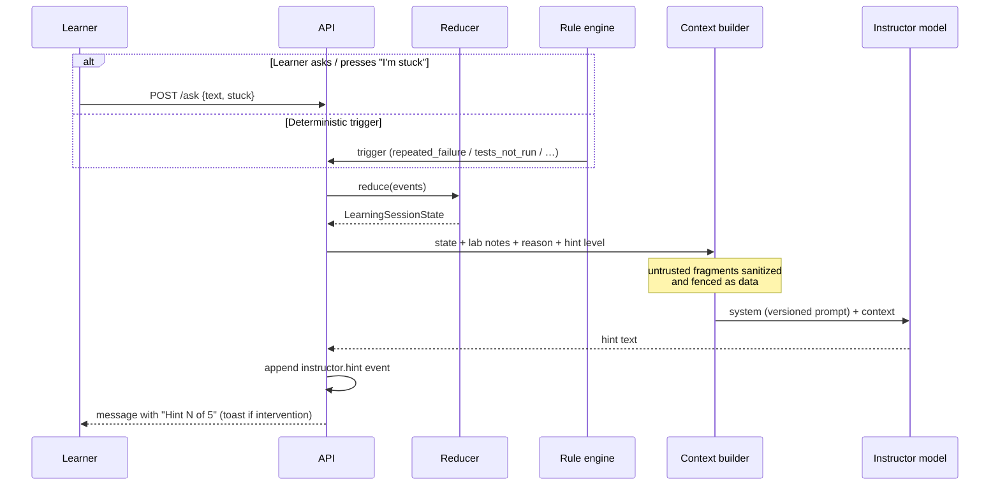
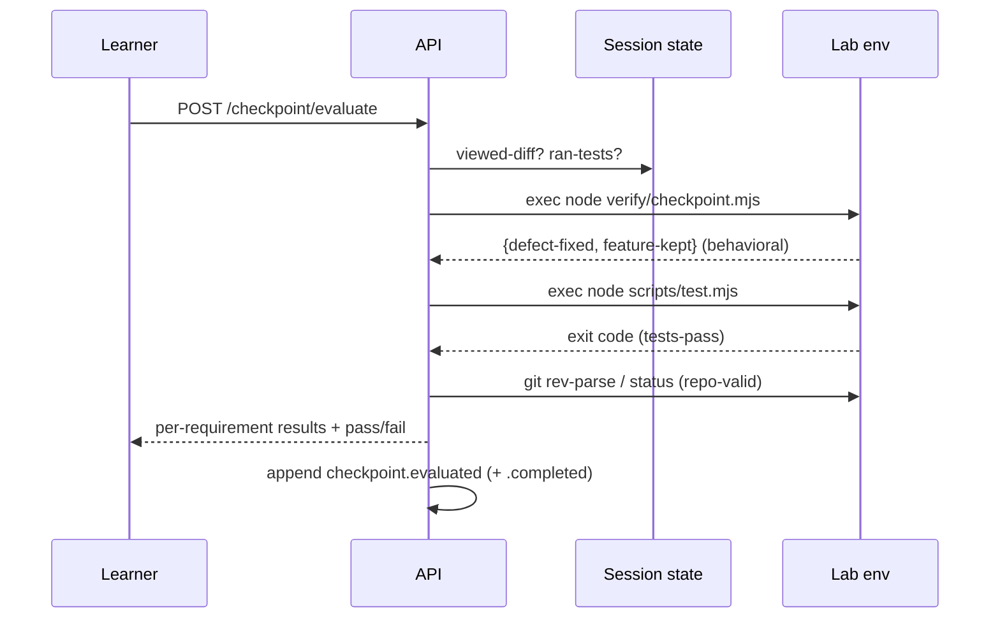

# Trellis — architecture diagrams

## System overview

```mermaid
graph TB
    subgraph Browser
        UI[React UI<br/>lesson · terminal · instructor]
        XT[xterm.js]
    end

    subgraph API["API server (Node, zero-dep)"]
        WS[miniWs<br/>token-gated WebSocket]
        HTTP[HTTP routes]
        SM[SessionManager]
        HUB[Terminal hub<br/>scrollback · fan-out · respawn]
        INST[SessionInstrumentation<br/>command/file/test channels]
        RED[Reducer<br/>events → state]
        RULES[Intervention rules<br/>deterministic]
        EVAL[Checkpoint evaluator<br/>deterministic]
        CTX[Context builder<br/>trust boundary]
        PROV[Instructor provider<br/>mock / OpenAI-compatible]
        DB[(SQLite<br/>append-only events)]
    end

    subgraph Lab["Disposable lab env (per session)"]
        DRV[LabDriver<br/>local / docker]
        SH[Instrumented bash<br/>pty via script&#40;1&#41;]
        REPO[(Git workspace<br/>+ planted defect)]
        VER[verify/checkpoint.mjs]
    end

    XT <-->|keystrokes / output| WS
    UI -->|REST + token| HTTP
    WS --> HUB --> SH
    SH --> REPO
    INST -->|poll channels + git hashes| DRV
    DRV --> SH
    INST --> DB
    HTTP --> SM --> DRV
    RED --> RULES --> PROV
    DB --> RED
    RED --> CTX --> PROV
    EVAL -->|exec inside lab| VER
    HTTP --> EVAL
```

## Hint flow (question or intervention)

```mermaid
sequenceDiagram
    participant L as Learner
    participant API as API
    participant R as Reducer
    participant IR as Rule engine
    participant CB as Context builder
    participant M as Instructor model

    alt Learner asks / presses "I'm stuck"
        L->>API: POST /ask {text, stuck}
    else Deterministic trigger
        IR->>API: trigger (repeated_failure / tests_not_run / …)
    end
    API->>R: reduce(events)
    R-->>API: LearningSessionState
    API->>CB: state + lab notes + reason + hint level
    Note over CB: untrusted fragments sanitized<br/>and fenced as data
    CB->>M: system (versioned prompt) + context
    M-->>API: hint text
    API->>API: append instructor.hint event
    API-->>L: message with "Hint N of 5" (toast if intervention)
```

## Checkpoint flow (never LLM-judged)

```mermaid
sequenceDiagram
    participant L as Learner
    participant API as API
    participant S as Session state
    participant Lab as Lab env

    L->>API: POST /checkpoint/evaluate
    API->>S: viewed-diff? ran-tests?
    API->>Lab: exec node verify/checkpoint.mjs
    Lab-->>API: {defect-fixed, feature-kept} (behavioral)
    API->>Lab: exec node scripts/test.mjs
    Lab-->>API: exit code (tests-pass)
    API->>Lab: git rev-parse / status (repo-valid)
    API-->>L: per-requirement results + pass/fail
    API->>API: append checkpoint.evaluated (+ .completed)
```
