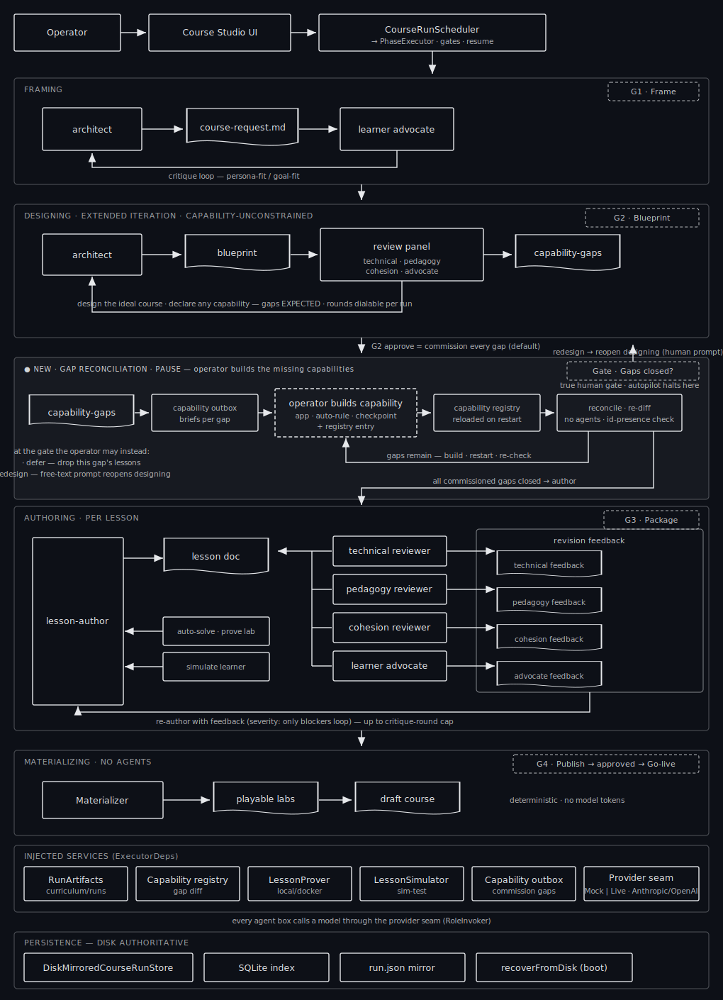

# Gap-reconciliation pause (designing → authoring)

**Status:** proposed (no code yet) · **Branch:** `feature/course-planning-rework`
· **Owner directive:** design blueprints for the *ideal* course, then close the
capability gaps deliberately before authoring.

## Problem

Today the pipeline treats the current virtual-desktop capabilities as a ceiling
on the blueprint. The designing prompt actively steers the architect toward what
already exists — [`executor.ts`](../../packages/course-architect/src/executor.ts)
tells it: *"Prefer capabilities from CONTEXT.availableCapabilities; only introduce
a new (gap) capability when a lesson genuinely needs it."* And a commissioned gap
is a **cross-run deferral**: the blocked lesson is dropped from this run and only
authored on some *future* run once the capability happens to ship
([`gaps.ts`](../../packages/course-architect/src/gaps.ts) `lessonsBlockedByGaps`,
[`server.ts`](../../apps/api/src/server.ts) `commissionAuthoringGaps`).

We want the opposite posture:

1. Spend **more** iteration in designing and design the pedagogically ideal
   course, unconstrained by today's capabilities. Gaps are an *expected* output.
2. A **pause after designing** where the operator implements the code that closes
   those gaps (a new app / auto-rule / checkpoint kind + registry entry).
3. A **reconcile step** that re-evaluates the blueprint's gaps against the now-
   updated registry, looping until they're closed — **all before authoring**.

## Proposed flow

The as-built (pre-change) view lives in
[`course-generation-flow.svg`](../diagrams/course-generation-flow.svg).

## Design

### 1. Designing aims higher

- Loosen the blueprint prompt: design the ideal course, declare whatever
  capability each lesson *should* rely on, and treat gaps as normal output rather
  than something to avoid.
- Raise the designing iteration budget (more architect ↔ review-panel rounds
  before G2). Prompt + round-cap/config change; low risk.

### 2. New `reconciling` phase + `reconcile` gate

The state machine is enum-driven in
[`types.ts`](../../packages/course-architect/src/types.ts). Insert one phase and
one gate between `designing` and `authoring`:

- `PHASES = ["framing", "designing", "reconciling", "authoring", "materializing"]`
- new gate `reconcile`; `NEXT_PHASE_AFTER_GATE.blueprint = "reconciling"`,
  `reconcile → authoring`; add the `awaiting-reconcile` status.
- The `reconciling` executor is **deterministic, no agents** (like materializing):
  it re-runs `computeCapabilityGaps(blueprint.lessonInventory, liveRegistry)` and
  rewrites `capability-gaps.json`. This *is* the reconcile step.

### 3. The pause is a loop, hard-blocked

- At **G2 (blueprint)** the operator dispositions gaps
  (commission / defer / redesign) exactly as today via `applyGapDispositions`,
  which already writes the outbox briefs the dev side picks up
  ([`capabilityRequests.ts`](../../apps/api/src/capabilityRequests.ts)).
- The run advances to `reconciling`, which re-diffs and parks at the **reconcile
  gate**, showing "N commissioned gaps still open / all closed."
- **Loop:** operator builds the capability + registry entry, restarts the API →
  `capabilityIdSet()` reloads → operator requests **changes** on the reconcile
  gate → `reconciling` re-diffs → parks again.
- **Hard block:** the reconcile gate cannot be *approved* while any
  **commissioned** gap is still open. `defer` gaps pass through (their lessons
  drop from the run); `redesign` is resolved by a G2 changes-request that removes
  the requiredCapability. Only when zero commissioned gaps remain does approve →
  `authoring`.

By the time authoring runs, the commissioned capabilities exist, so authoring's
existing skip-of-blocked-lessons becomes a safety net rather than the main path.

## The one real gotcha

`availableCapabilities` is a **snapshot captured at server boot** —
[`server.ts`](../../apps/api/src/server.ts) passes `capabilityIdSet()` once into
the executor. Because capabilities are *code*, a restart is required to load a
newly-built capability anyway, and the restart rebuilds the executor with the
fresh registry — so reconcile-after-restart naturally sees the new state. We keep
that (simplest) rather than making the registry hot-reloadable; the reconcile
gate's UI is explicit that closing a gap means "build it, then restart to reload."

## Blast radius

| File | Change |
|---|---|
| `packages/course-architect/src/types.ts` | phase/gate enums, `RunStatus` union, `awaiting-reconcile`, `GATE_OF_PHASE`/`PHASE_OF_GATE`/`NEXT_PHASE_AFTER_GATE` maps |
| `packages/course-architect/src/executor.ts` | new `runReconciling`; loosen blueprint prompt; bump designing rounds |
| `apps/api/src/server.ts` | route the reconcile gate; reconcile-changes re-diff; hard-block approve while commissioned gaps open; surface open-vs-closed counts |
| `apps/web/src/pages/CourseStudio.tsx` | render the reconcile gate — gap checklist, "build these / restart / re-check" |
| persistence | `awaiting-reconcile` flows through `DiskMirroredCourseRunStore` as a string; no schema change |
| tests | `pipeline.test.ts`, `resume-authoring.test.ts` grow a reconcile leg |

Nothing has shipped, so in-flight runs can be swept — no migration.

## Open questions / deferred

- Whether `reconciling` should auto-re-diff on server boot (so a restart alone
  advances the gate view without an explicit "changes" click). Deferred; the
  explicit re-check keeps the operator in control.
- Batch view across runs of all open capability requests (the outbox already
  supports listing) — nice-to-have, not required for this change.
